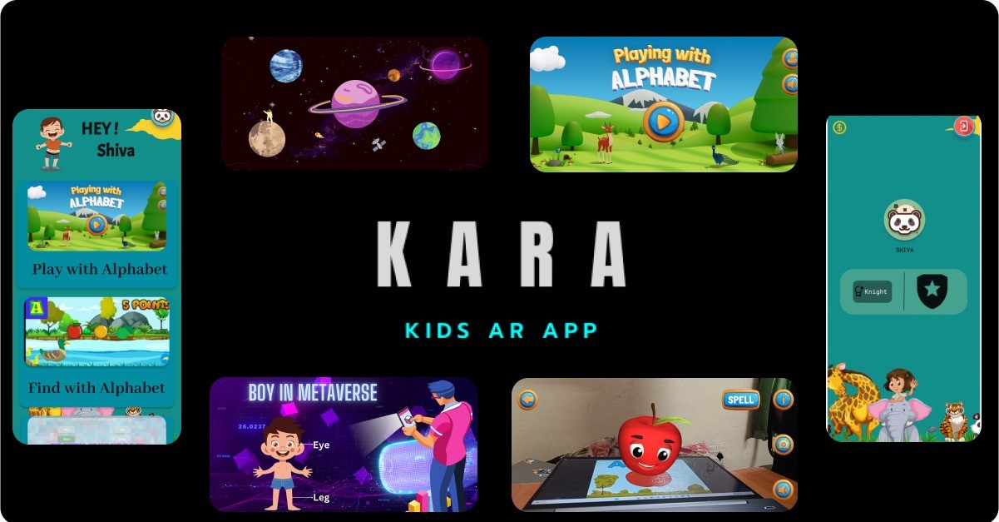
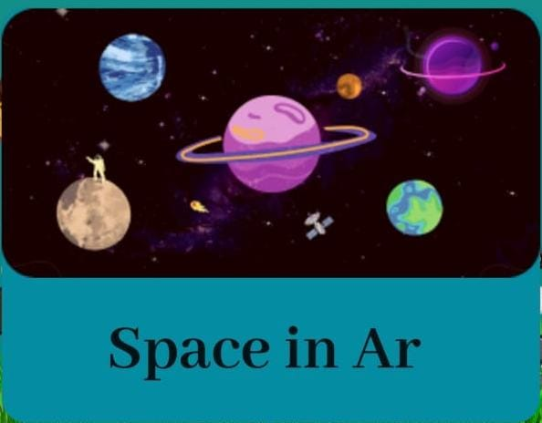
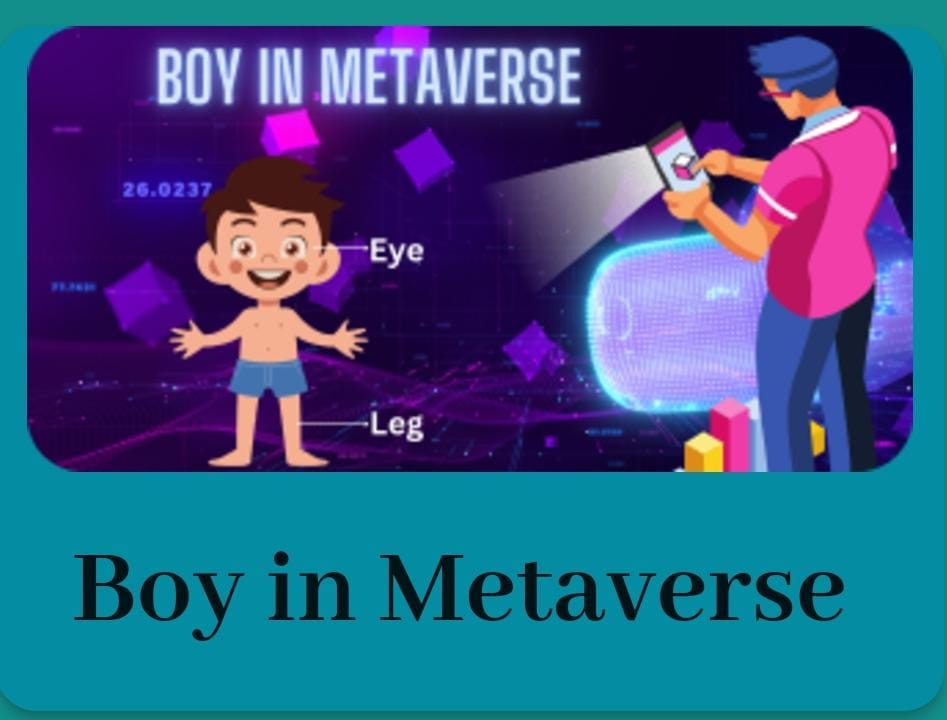
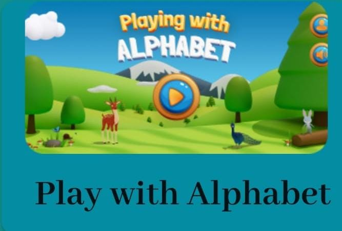
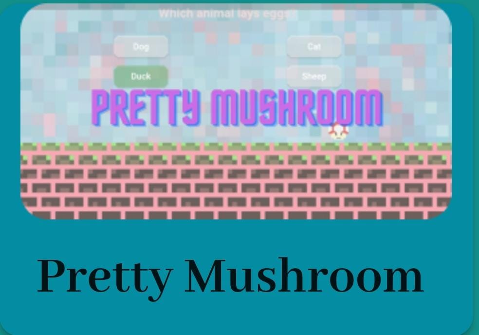

# KARA - Kids Augmented Reality  App

KARA targets the Kids, using our AR and VR-driven content based on our current NEP-2020 policy we have created content that will change the future of learning in a most innovative manner.

Kara is a simple, engaging, and interactive learning App for kids, focusing on STEM-based learning using Extended Reality and Mixed reality. It works on the basis of creating a virtual world – real or fictional – that users can see and interact with.

## Demo

## Features
1. AR Model - A VR model of the solar system which gives you an ultimate experience of the universe as you can watch various features of the solar system.

2. AR Model - An AR model of the various parts of a human body. Helps remember the names better .

3. AR Model - Playing with alphabets - This is a visual aid which helps in learning alphabets.

4. Game 1 (Find with alphabet) - It is a game in which we have to choose the correct image which starts with the given alphabet.

5. Game 2 (Pretty Mushroom) - It is a science trivia game which presents quiz as a way to win various coins.

